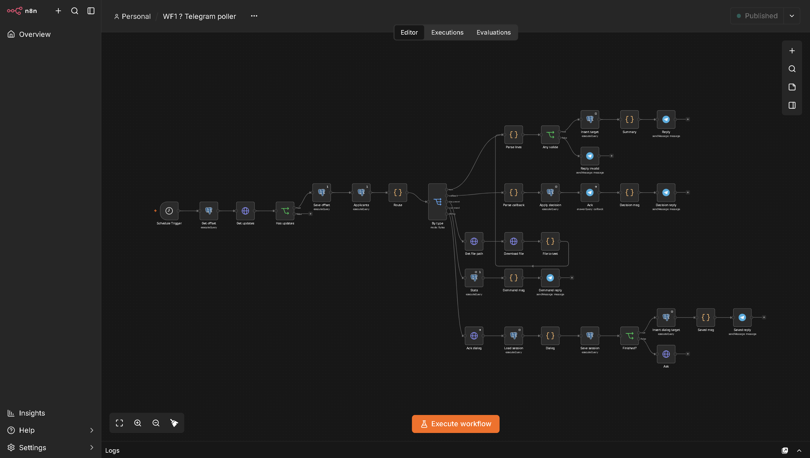
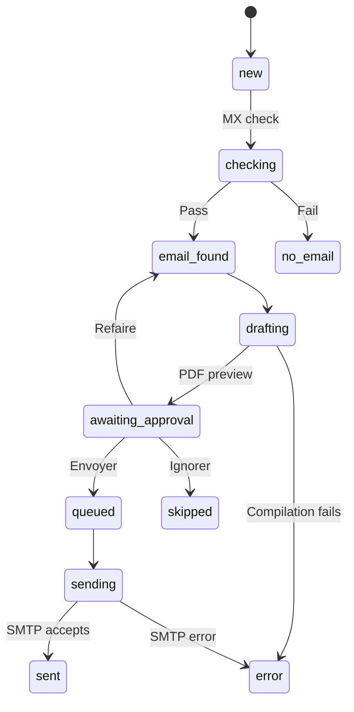

# Candidature Bot

[English](README.md) · [Français](README.fr.md) · **Deutsch** · [فارسی](README.fa.md)

**Bewerbungen über Telegram vorbereiten, prüfen und versenden.**

Candidature Bot ist eine selbst gehostete Pipeline auf Basis von **n8n, PostgreSQL, Docker und LaTeX**. Sie nennen dem Bot in einem französischsprachigen Telegram-Chat den Namen und die E-Mail-Adresse eines Arbeitgebers. Er prüft die E-Mail-Domain, erzeugt ein Anschreiben als PDF, legt es Ihnen zur Freigabe vor und versendet die freigegebene Bewerbung in gleichmäßigem Takt per E-Mail.

Das Anschreiben ist eine feste Vorlage: Pro Arbeitgeber ändern sich nur der Empfängerblock und das Datum. **Kein KI-Modell schreibt oder überarbeitet etwas.**

*WF1, die Telegram-Schnittstelle. Alle vier Workflows zeigt [The workflows in n8n](docs/WORKFLOWS.md) (auf Englisch).*

## Funktionen

- Geführte Erfassung eines Arbeitgebers, Anschrift und HR-Kontakt sind optional.
- Eingefügte Kontaktblöcke und Sammelimport mit Semikolon-getrennten Zeilen.
- Zugriff nur für registrierte Telegram-Chats.
- Prüfung der E-Mail-Domain (MX-Einträge), bevor ein Anschreiben erstellt wird.
- Anschreiben als PDF, kompiliert mit Tectonic.
- Freigabe in Telegram mit den Schaltflächen **Envoyer**, **Refaire** und **Ignorer**; ohne sie wird nichts versendet.
- Geplanter SMTP-Versand mit Lebenslauf und Erklärung im Anhang, begrenzt pro Tag.
- Statusverfolgung und Übersicht mit `/stats`.

Betreff und Anhangsname der Vorlage zielen auf eine luxemburgische Ausbildung **DAP Agent administratif et commercial**. Passen Sie Betreff, Anschreiben, E-Mail-Text und Erklärung für andere Bewerbungen an.

## Funktionsweise

Vier Workflows laufen unabhängig voneinander und übergeben die Arbeit über den `status` jedes Arbeitgeber-Datensatzes in PostgreSQL.

| Workflow | Zeitplan | Aufgabe |
|---|---|---|
| WF1 — Telegram poller | Alle 5 Sekunden | Nachrichten empfangen, Dialog führen, Arbeitgeber speichern, Freigabeentscheidungen anwenden |
| WF2 — MX check | Alle 2 Minuten | Bis zu 10 neue E-Mail-Domains prüfen |
| WF3 — Drafting | Alle 3 Minuten | Ein Anschreiben erzeugen und um Freigabe bitten |
| WF4 — Sending | Werktags alle 30 Minuten, 08:00 bis 17:30 | Pro Bewerber eine freigegebene Bewerbung versenden |

`sent` bedeutet, dass der Mailserver die Nachricht angenommen hat, nicht dass sie beim Empfänger angekommen ist. Der Zeitplan ist für die Zeitzone `Europe/Luxembourg` gedacht.

## Den Bot benutzen

| Befehl | Zweck |
|---|---|
| `/start` | Begrüßung anzeigen |
| `/nouveau` oder `/new` | Erfassung eines Arbeitgebers beginnen |
| `/hr` oder `/rh` | HR-Kontakt während einer Erfassung eingeben |
| `/annuler` | Laufende Erfassung abbrechen |
| `/stats` | Anzahl der Bewerbungen je Status anzeigen |

Senden Sie `/nouveau` und beantworten Sie die Fragen, oder fügen Sie alle Angaben auf einmal ein. Prüfen Sie die Zusammenfassung vor dem Speichern: Der Bot kann nicht erkennen, wenn ein Firmenname mit der E-Mail-Adresse einer anderen Firma kombiniert wurde.

Wenn die PDF-Vorschau eintrifft:

- **Envoyer** stellt die Bewerbung in die Warteschlange für den nächsten Versandtermin.
- **Refaire** erzeugt sie neu aus der aktuellen Vorlage. Die Schaltflächen der älteren Vorschau funktionieren danach nicht mehr.
- **Ignorer** überspringt die Bewerbung.

Die [Demo-Mitschriften](docs/DEMO.de.md) zeigen vollständige Beispielsitzungen mit erfundenen Daten, einschließlich Sammelimport.

## Einrichtung und Dokumentation

Die technischen Anleitungen sind auf Englisch.

| Anleitung | Inhalt |
|---|---|
| [Installation and credentials](docs/SETUP.md) | Docker, Datenbankschema, private Dokumente, Zugangsdaten, erster Testversand |
| [Demo-Mitschriften](docs/DEMO.de.md) | Wie jedes Szenario in Telegram aussieht |
| [The workflows in n8n](docs/WORKFLOWS.md) | Screenshots der vier Workflows und Aufbau des Repositorys |
| [Operations and limitations](docs/OPERATIONS.md) | Fehlersuche, Wiederherstellung, bekannte Schwächen |
| [Testing](docs/TESTING.md) | Datenbanktests für die Abfragen der Workflows und wie man sie ausführt |
| [Publishing on GitHub](docs/PUBLISHING.md) | Workflows weitergeben, ohne private Daten preiszugeben |

Eine Installation braucht vier Dinge, die nicht in diesem Repository liegen: eine `.env`-Datei mit Ihren Geheimnissen, einen Bewerber-Datensatz, Ihre privaten Dokumente (Briefvorlage, E-Mail-Text, Lebenslauf, Erklärung) und die in n8n eingetragenen Zugangsdaten.

## Einschränkungen

- Die MX-Prüfung beweist nicht, dass ein Postfach existiert, und ein vorübergehender DNS-Fehler kann eine gültige Domain als ungültig markieren.
- Schlägt WF1 fehl, nachdem es Telegram-Updates gelesen hat, gehen diese Nachrichten verloren.
- Überlappende WF4-Läufe können dieselbe Bewerbung nicht doppelt versenden. Ein Duplikat bleibt in einem Fall möglich: Der Mailserver nimmt die Nachricht an, der Workflow scheitert vor dem Vermerk, und die Bewerbung wird danach von Hand erneut eingereiht.
- Ein in `checking` oder `drafting` unterbrochener Datensatz wird nach 15 Minuten erneut aufgegriffen. Ein in `sending` unterbrochener wird nie automatisch wiederholt und wartet auf eine manuelle Prüfung.
- Unzustellbarkeitsmeldungen und Antworten werden nicht erfasst.
- Teile von WF1 gehen von einem einzigen Bewerber aus.
- Ein Arbeitgeber wird als Duplikat abgelehnt, wenn sein Name oder seine E-Mail-Domain für den Bewerber bereits gespeichert ist.

Einzelheiten und Verbesserungsvorschläge stehen im [Betriebshandbuch](docs/OPERATIONS.md).

## Stand

Die Dokumentation beruht auf dem Lesen der Workflows und der Konfiguration. Das Schema und alle Abfragen der Workflows sind durch [Datenbanktests](docs/TESTING.md) abgedeckt, einschließlich der Freigaberegeln und des gleichzeitigen Versands. Diese Tests führen weder n8n noch Telegram noch einen Mailserver aus; die gesamte Pipeline wurde aus diesem Repository heraus also nicht durchgängig getestet. Beginnen Sie mit einem Bewerber und senden Sie die erste Bewerbung an eine Adresse, die Sie selbst kontrollieren.

Telegram-Nachrichten, DNS-Abfragen und E-Mails laufen über externe Dienste, auch wenn alles andere selbst gehostet ist.
