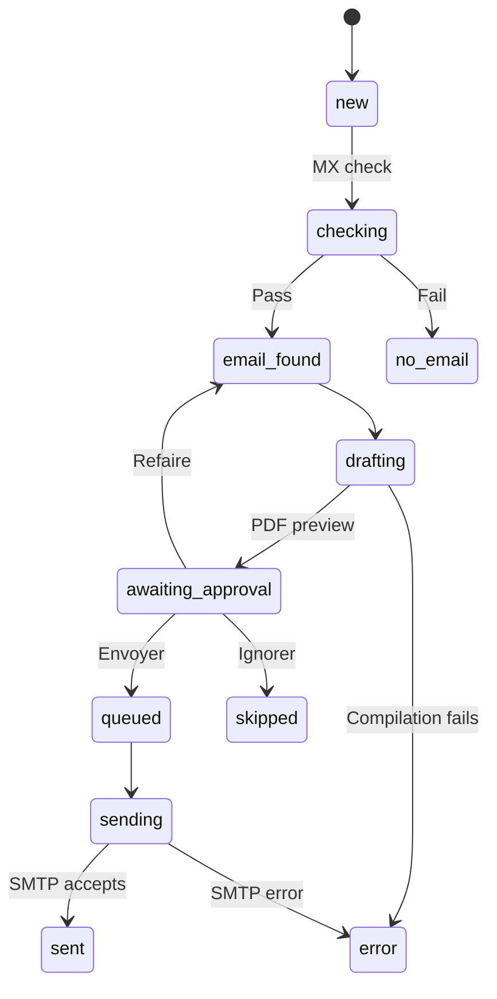

# Candidature Bot

[English](README.md) · [Français](README.fr.md) · [Deutsch](README.de.md) · **فارسی**

**آماده‌سازی، بازبینی و ارسال درخواست‌های کاری از طریق تلگرام.**

Candidature Bot یک سامانهٔ خودمیزبان است که با **n8n، PostgreSQL، Docker و LaTeX** ساخته شده است. شما در یک گفت‌وگوی تلگرامی به زبان فرانسوی، نام و نشانی ایمیل یک کارفرما را به ربات می‌دهید. ربات دامنهٔ ایمیل را بررسی می‌کند، نامهٔ انگیزشی را به صورت PDF می‌سازد، آن را برای تأیید به شما نشان می‌دهد و درخواستِ تأییدشده را با آهنگی منظم ایمیل می‌کند.

نامه یک قالب ثابت است: برای هر کارفرما فقط بخش گیرنده و تاریخ تغییر می‌کند. **هیچ مدل هوش مصنوعی چیزی نمی‌نویسد و بازنویسی نمی‌کند.**

*WF1، رابط تلگرام. هر چهار گردش‌کار در صفحهٔ [The workflows in n8n](docs/WORKFLOWS.md) (به انگلیسی) نمایش داده شده‌اند.*

## امکانات

- ثبت گام‌به‌گام کارفرما؛ نشانی پستی و مخاطب منابع انسانی اختیاری است.
- چسباندن یک‌جای اطلاعات تماس و ورود گروهی با سطرهایی که با نقطه‌ویرگول جدا شده‌اند.
- دسترسی فقط برای گفت‌وگوهای تلگرامیِ ثبت‌شده.
- بررسی دامنهٔ ایمیل (رکوردهای MX) پیش از ساخت هر نامه.
- نامهٔ انگیزشی به صورت PDF که با Tectonic ساخته می‌شود.
- تأیید در تلگرام با دکمه‌های **Envoyer**، **Refaire** و **Ignorer**؛ بدون تأیید هیچ چیزی فرستاده نمی‌شود.
- ارسال زمان‌بندی‌شده با SMTP همراه با رزومه و اظهارنامه به صورت پیوست، با سقف روزانه.
- پیگیری وضعیت‌ها و خلاصه با دستور `/stats`.

موضوع ایمیل و نام پیوستِ موجود برای یک دورهٔ کارآموزی در لوکزامبورگ با عنوان **DAP Agent administratif et commercial** تنظیم شده است. برای درخواست‌های دیگر، موضوع، نامه، متن ایمیل و اظهارنامه را تغییر دهید.

## سازوکار

چهار گردش‌کار مستقل از هم اجرا می‌شوند و کار را از طریق ستون `status` هر رکورد کارفرما در PostgreSQL به یکدیگر تحویل می‌دهند.

| گردش‌کار | زمان‌بندی | وظیفه |
|---|---|---|
| WF1 — Telegram poller | هر ۵ ثانیه | دریافت پیام‌ها، پیش‌بردن گفت‌وگو، ذخیرهٔ کارفرماها، اعمال تصمیم‌های تأیید |
| WF2 — MX check | هر ۲ دقیقه | بررسی حداکثر ۱۰ دامنهٔ ایمیل جدید |
| WF3 — Drafting | هر ۳ دقیقه | ساخت یک نامه و درخواست تأیید |
| WF4 — Sending | روزهای کاری، هر ۳۰ دقیقه، از 08:00 تا 17:30 | ارسال یک درخواست تأییدشده برای هر متقاضی |

وضعیت `sent` یعنی سرور ایمیل پیام را پذیرفته است، نه اینکه پیام به دست گیرنده رسیده باشد. زمان‌بندی برای منطقهٔ زمانی `Europe/Luxembourg` در نظر گرفته شده است.

## کار با ربات

| دستور | کاربرد |
|---|---|
| `/start` | نمایش پیام خوشامد |
| `/nouveau` یا `/new` | شروع ثبت یک کارفرما |
| `/hr` یا `/rh` | وارد کردن مخاطب منابع انسانی هنگام ثبت |
| `/annuler` | لغو ثبتِ در جریان |
| `/stats` | نمایش تعداد درخواست‌ها به تفکیک وضعیت |

دستور `/nouveau` را بفرستید و به پرسش‌ها پاسخ دهید، یا همهٔ اطلاعات را یک‌جا بچسبانید. پیش از ذخیره، خلاصه را بازبینی کنید: ربات نمی‌تواند تشخیص دهد که نام یک شرکت با نشانی ایمیل شرکت دیگری همراه شده است.

وقتی پیش‌نمایش PDF می‌رسد:

- **Envoyer** درخواست را برای نوبت ارسال بعدی در صف می‌گذارد.
- **Refaire** آن را دوباره از روی قالب فعلی می‌سازد. پس از آن دکمه‌های پیش‌نمایش قبلی دیگر کار نمی‌کنند.
- **Ignorer** درخواست را کنار می‌گذارد.

[رونوشت‌های نمونه](docs/DEMO.fa.md) جلسه‌های کامل را، از جمله ورود گروهی، با داده‌های ساختگی نشان می‌دهند.

## راه‌اندازی و مستندات

راهنماهای فنی به زبان انگلیسی هستند.

| راهنما | محتوا |
|---|---|
| [Installation and credentials](docs/SETUP.md) | Docker، ساختار پایگاه داده، اسناد خصوصی، اطلاعات ورود، نخستین ارسال آزمایشی |
| [رونوشت‌های نمونه](docs/DEMO.fa.md) | هر سناریو در تلگرام چه شکلی دارد |
| [The workflows in n8n](docs/WORKFLOWS.md) | تصویر چهار گردش‌کار و ساختار مخزن |
| [Operations and limitations](docs/OPERATIONS.md) | عیب‌یابی، بازیابی، ضعف‌های شناخته‌شده |
| [Testing](docs/TESTING.md) | آزمون‌های پایگاه داده برای پرس‌وجوهای گردش‌کارها و روش اجرای آن‌ها |
| [Publishing on GitHub](docs/PUBLISHING.md) | انتشار گردش‌کارها بدون افشای دادهٔ خصوصی |

هر استقرار به چهار چیز نیاز دارد که در این مخزن نیست: فایل `.env` با مقادیر محرمانهٔ شما، یک رکورد متقاضی، اسناد خصوصی شما (قالب نامه، متن ایمیل، رزومه، اظهارنامه) و اطلاعات ورودی که در n8n وارد می‌کنید.

## محدودیت‌ها

- بررسی MX وجود صندوق ایمیل را ثابت نمی‌کند، و یک خطای موقت DNS می‌تواند دامنه‌ای سالم را نامعتبر نشان دهد.
- اگر WF1 پس از خواندن به‌روزرسانی‌های تلگرام با خطا روبه‌رو شود، آن پیام‌ها از دست می‌روند.
- اجراهای هم‌زمانِ WF4 نمی‌توانند یک درخواست را دو بار بفرستند. تکرار فقط در یک حالت ممکن است: سرور ایمیل پیام را بپذیرد، گردش‌کار پیش از ثبت آن با خطا روبه‌رو شود و سپس درخواست دستی دوباره در صف گذاشته شود.
- رکوردی که در وضعیت `checking` یا `drafting` متوقف شود پس از ۱۵ دقیقه دوباره برداشته می‌شود. رکوردی که در وضعیت `sending` متوقف شود هرگز خودکار دوباره فرستاده نمی‌شود و منتظر بررسی دستی می‌ماند.
- ایمیل‌های برگشتی و پاسخ‌ها پیگیری نمی‌شوند.
- بخش‌هایی از WF1 فرض می‌کنند فقط یک متقاضی وجود دارد.
- اگر نام کارفرما یا دامنهٔ ایمیل او پیش‌تر برای همان متقاضی ذخیره شده باشد، به عنوان تکراری رد می‌شود.

جزئیات و اصلاح‌های پیشنهادی در [راهنمای بهره‌برداری](docs/OPERATIONS.md) آمده است.

## وضعیت پروژه

این مستندات از خواندن گردش‌کارها و پیکربندی به دست آمده است. ساختار پایگاه داده و همهٔ پرس‌وجوهای گردش‌کارها با [آزمون‌های پایگاه داده](docs/TESTING.md) پوشش داده شده‌اند، از جمله قواعد تأیید و ارسال هم‌زمان. این آزمون‌ها n8n، تلگرام یا سرور ایمیل را اجرا نمی‌کنند، پس کل سامانه از روی این مخزن به صورت سرتاسری آزموده نشده است. با یک متقاضی شروع کنید و نخستین درخواست را به نشانی‌ای بفرستید که در اختیار خودتان است.

پیام‌های تلگرام، پرس‌وجوهای DNS و ایمیل‌ها از سرویس‌های بیرونی عبور می‌کنند، هرچند بقیهٔ اجزا خودمیزبان هستند.

