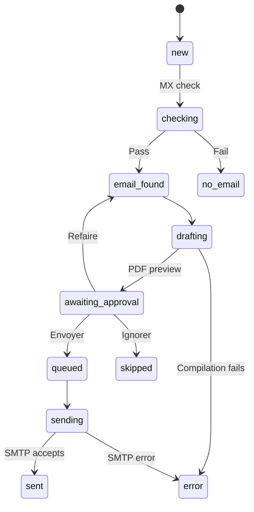

# Candidature Bot

[English](README.md) · **Français** · [Deutsch](README.de.md) · [فارسی](README.fa.md)

**Préparer, relire et envoyer des candidatures depuis Telegram.**

Candidature Bot est une chaîne de traitement auto-hébergée, construite avec **n8n, PostgreSQL, Docker et LaTeX**. Vous donnez au bot le nom et l'adresse e-mail d'un employeur dans une conversation Telegram en français. Il vérifie le domaine de l'adresse, génère une lettre de motivation en PDF, vous la montre pour validation, puis envoie la candidature validée par e-mail à un rythme régulier.

La lettre est un modèle fixe : seuls le bloc destinataire et la date changent d'un employeur à l'autre. **Aucun modèle d'IA n'écrit ni ne réécrit quoi que ce soit.**

*WF1, l'interface Telegram. Les quatre workflows sont présentés dans [The workflows in n8n](docs/WORKFLOWS.md) (en anglais).*

## Fonctionnalités

- Saisie guidée d'un employeur, avec adresse et contact RH facultatifs.
- Blocs de coordonnées collés tels quels et import en masse par lignes séparées par des points-virgules.
- Accès limité aux conversations Telegram enregistrées.
- Vérification du domaine e-mail (enregistrements MX) avant toute rédaction.
- Lettres de motivation en PDF compilées avec Tectonic.
- Validation dans Telegram avec les boutons **Envoyer**, **Refaire** et **Ignorer** ; rien ne part sans elle.
- Envoi SMTP planifié, avec CV et déclaration en pièces jointes, plafonné par jour.
- Suivi des statuts et résumé par `/stats`.

L'objet et le nom de la pièce jointe fournis visent un apprentissage luxembourgeois **DAP Agent administratif et commercial**. Adaptez l'objet, la lettre, le texte de l'e-mail et la déclaration pour d'autres candidatures.

## Fonctionnement

Quatre workflows tournent indépendamment et se passent le travail par le `status` de chaque enregistrement d'employeur dans PostgreSQL.

| Workflow | Fréquence | Rôle |
|---|---|---|
| WF1 — Telegram poller | Toutes les 5 secondes | Recevoir les messages, mener le dialogue, enregistrer les employeurs, appliquer les décisions |
| WF2 — MX check | Toutes les 2 minutes | Vérifier jusqu'à 10 nouveaux domaines e-mail |
| WF3 — Drafting | Toutes les 3 minutes | Générer une lettre et demander la validation |
| WF4 — Sending | En semaine, toutes les 30 minutes, de 08:00 à 17:30 | Envoyer une candidature validée par candidat |

`sent` signifie que le serveur de messagerie a accepté le message, pas qu'il est arrivé chez le destinataire. La planification est prévue pour le fuseau horaire `Europe/Luxembourg`.

## Utiliser le bot

| Commande | Rôle |
|---|---|
| `/start` | Afficher le message d'accueil |
| `/nouveau` ou `/new` | Commencer la saisie d'un employeur |
| `/hr` ou `/rh` | Saisir le contact RH pendant une saisie |
| `/annuler` | Annuler la saisie en cours |
| `/stats` | Afficher le nombre de candidatures par statut |

Envoyez `/nouveau` et répondez aux questions, ou collez toutes les informations d'un coup. Relisez le récapitulatif avant d'enregistrer : le bot ne peut pas savoir qu'un nom d'entreprise est associé à l'adresse e-mail d'une autre entreprise.

Quand l'aperçu PDF arrive :

- **Envoyer** place la candidature dans la file pour le prochain créneau d'envoi.
- **Refaire** la génère de nouveau à partir du modèle actuel. Les boutons de l'ancien aperçu cessent alors de fonctionner.
- **Ignorer** écarte la candidature.

Les [transcriptions de démonstration](docs/DEMO.fr.md) montrent des sessions complètes, import en masse compris, avec des données inventées.

## Installation et documentation

Les guides techniques sont en anglais.

| Guide | Contenu |
|---|---|
| [Installation and credentials](docs/SETUP.md) | Docker, schéma de base de données, documents privés, identifiants, premier envoi de test |
| [Transcriptions de démonstration](docs/DEMO.fr.md) | À quoi ressemble chaque scénario dans Telegram |
| [The workflows in n8n](docs/WORKFLOWS.md) | Captures des quatre workflows et organisation du dépôt |
| [Operations and limitations](docs/OPERATIONS.md) | Dépannage, reprise, faiblesses connues |
| [Testing](docs/TESTING.md) | Tests en base de données des requêtes des workflows et façon de les lancer |
| [Publishing on GitHub](docs/PUBLISHING.md) | Partager les workflows sans divulguer de données privées |

Un déploiement a besoin de quatre éléments absents de ce dépôt : un fichier `.env` avec vos secrets, un enregistrement de candidat, vos documents privés (modèle de lettre, texte de l'e-mail, CV, déclaration) et les identifiants saisis dans n8n.

## Limites

- La vérification MX ne prouve pas qu'une boîte aux lettres existe, et une panne DNS passagère peut faire rejeter un domaine valide.
- Si WF1 échoue après avoir lu les mises à jour Telegram, ces messages sont perdus.
- Deux exécutions simultanées de WF4 ne peuvent pas envoyer deux fois la même candidature. Un doublon reste possible dans un cas : le serveur de messagerie accepte le message, le workflow échoue avant de l'enregistrer, puis la candidature est remise en file à la main.
- Un enregistrement interrompu en `checking` ou `drafting` est repris au bout de 15 minutes. Un enregistrement interrompu en `sending` n'est jamais relancé automatiquement et attend une vérification manuelle.
- Les retours de non-distribution et les réponses ne sont pas suivis.
- Certaines parties de WF1 supposent un seul candidat.
- Un employeur est refusé comme doublon si son nom ou son domaine e-mail est déjà enregistré pour le candidat.

Les détails et les corrections proposées se trouvent dans le [guide d'exploitation](docs/OPERATIONS.md).

## État du projet

La documentation provient de la lecture des workflows et de la configuration. Le schéma et toutes les requêtes des workflows sont couverts par des [tests en base de données](docs/TESTING.md), y compris les règles de validation et l'envoi simultané. Ces tests n'exécutent ni n8n, ni Telegram, ni serveur de messagerie : la chaîne complète n'a donc pas été testée de bout en bout à partir de ce dépôt. Commencez avec un seul candidat et envoyez la première candidature à une adresse que vous contrôlez.

Les messages Telegram, les requêtes DNS et les e-mails passent par des services externes, même si tout le reste est auto-hébergé.
