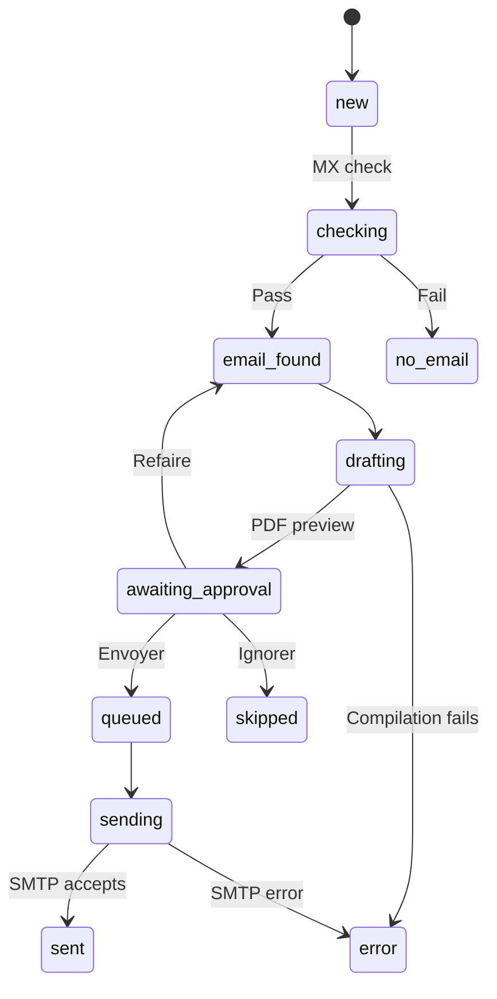
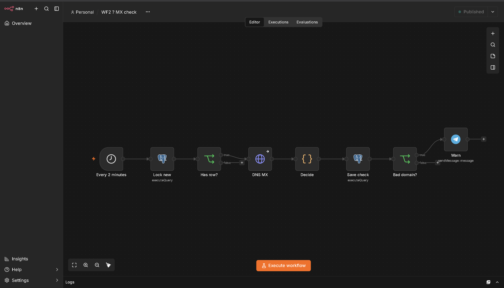
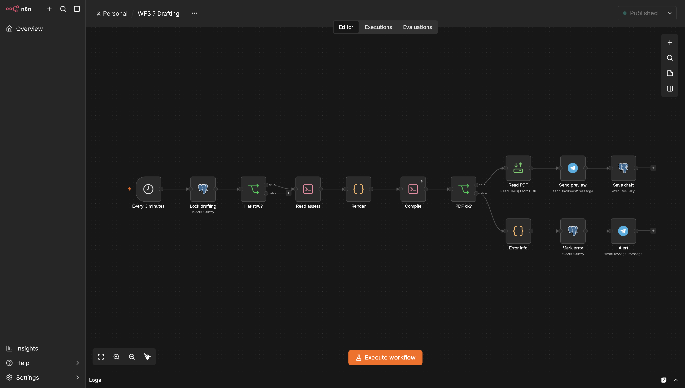
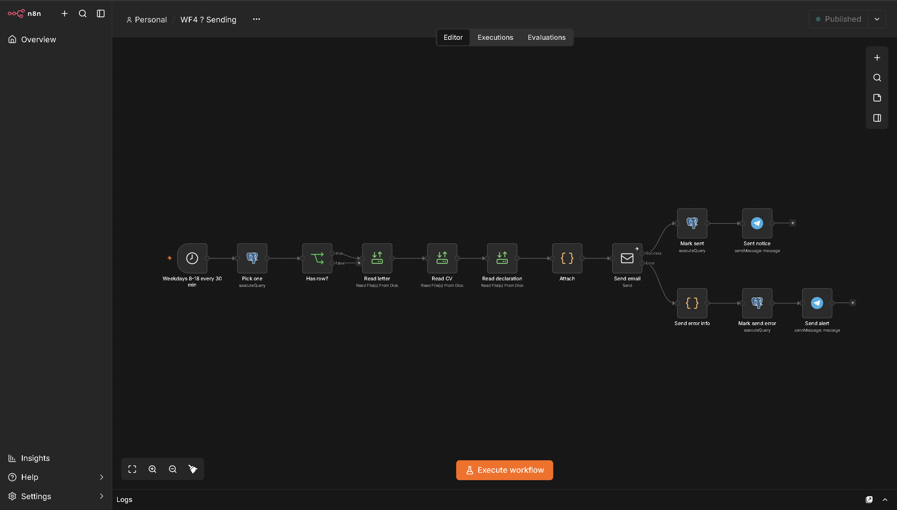

# Candidature Bot

**Prepare, review, and send job applications from Telegram.**

Candidature Bot is a self-hosted application workflow built with **n8n, PostgreSQL, Docker, and LaTeX**. Add an employer through a French-language Telegram conversation or a bulk text import. The system checks the email domain, generates a cover-letter PDF, asks for approval, and queues the application for scheduled email delivery.

Drafting uses a fixed template: the recipient block and date change for each employer. **No DeepSeek, OpenAI, or other LLM integration is present in these workflows.**

## Features

- Guided company entry with optional address and HR-contact details.
- Pasted contact blocks and semicolon-separated bulk imports.
- Telegram chat allowlist backed by PostgreSQL.
- Email-domain MX checks through Google Public DNS.
- Cover-letter PDFs compiled with Tectonic.
- Telegram preview with **Envoyer**, **Refaire**, and **Ignorer** buttons.
- Scheduled SMTP delivery with CV and declaration attachments.
- Application status tracking and `/stats` summaries.

The current templates target a Luxembourg **DAP Agent administratif et commercial** apprenticeship. The subject, letter, email sample, and declaration attachment must be adapted for other applications.

## Project status

This repository shares the workflow implementation and deployment configuration. A fresh deployment also needs the application database (created from `db/schema.sql`), an applicant record, private documents, and locally configured credentials. The schema was written from the workflow queries and tested against them; it is not a dump of the original installation. Private assets are not included.

The documentation is based on static inspection of WF1–WF4, the supplied Dockerfile, and Docker Compose configuration. It does not claim an end-to-end deployment test, guaranteed delivery, or duplicate-free sending. Start with one applicant and test only against an address you control.

## How it works

The four workflows run independently and exchange work through PostgreSQL records. Generated PDFs are shared through a Docker volume.

| Workflow | Schedule | Responsibility |
|---|---|---|
| WF1 — Telegram poller | Every 5 seconds | Receive messages, manage dialogs, save employers, process approval decisions |
| WF2 — MX check | Every 2 minutes | Check up to 10 new employer domains |
| WF3 — Drafting | Every 3 minutes | Generate one letter and request approval |
| WF4 — Sending | Weekdays, every 30 minutes from 08:00 to 17:30 | Send queued applications, normally one per applicant per run |

The intended schedule timezone is `Europe/Luxembourg`. Verify the workflow timezone and PostgreSQL timezone separately: the daily count is calculated in the database.



Some failures can leave a record in `checking`, `drafting`, or `sending`. `sent` means SMTP acceptance, not confirmed delivery to the recipient.

### The workflows in n8n

**WF1 — Telegram poller:** polling, routing, bulk import, approval buttons, commands, and the guided dialog.


**WF2 — MX check**



**WF3 — Drafting:** the upper branch sends the PDF preview, the lower one reports a compilation error.



**WF4 — Sending**



## Using the bot

| Command | Purpose |
|---|---|
| `/start` | Show the welcome message |
| `/nouveau` or `/new` | Start an employer entry |
| `/hr` or `/rh` | Enter HR details during an active dialog |
| `/annuler` | Cancel the current entry |
| `/stats` | Show application counts by status |

Start with `/nouveau` and answer the questions. Optional fields can be skipped. Review the recap before saving: input classification uses heuristics and may misinterpret pasted text.

Example contact block, using fictional data:

```text
/new Example Company
recruitment@example.com
12 rue Exemple
L-1234 Ville
/hr Madame Exemple
hr@example.com
```

Bulk input accepts one employer per line, either in a message or a text document:

```text
Company; company email; street address; postcode and town; HR name; HR email
Example Company; recruitment@example.com; 12 rue Exemple; L-1234 Ville; Madame Exemple; hr@example.com
```

The first line above explains the format; **do not include it as a header in the actual import**. Only the company name and company email are required.

When the PDF arrives:

- **Envoyer:** queue this application for a sending slot.
- **Refaire:** generate it again using the current template and stored details. The date may change; the body is not rewritten by AI.
- **Ignorer:** skip this application.

The preview contains the letter and recipient information. It does not preview every attachment or the complete final email; check the email sample, CV, and declaration during setup.

## Setup and documentation

1. Follow [Installation and credentials](docs/SETUP.md).
2. Run the controlled first-send checklist in that guide.
3. Use [Operations and limitations](docs/OPERATIONS.md) for troubleshooting.
4. Follow [Publishing on GitHub](docs/PUBLISHING.md) before sharing exports.

Recommended repository layout:

| Path | Purpose |
|---|---|
| `README.md` | Project overview and usage |
| `docs/` | Setup, operations, and publishing instructions |
| `workflows/WF1-Telegram-poller.json` | Telegram interface |
| `workflows/WF2-MX-check.json` | Domain checks |
| `workflows/WF3-Drafting.json` | PDF generation |
| `workflows/WF4-Sending.json` | Email sending |
| `Dockerfile` | n8n 2.42.4 image with Tectonic |
| `docker-compose.yml` | Containers, environment, and volumes |
| `db/schema.sql` | Application tables, constraints, and initial state |
| `db/applicant.example.sql` | Fictional applicant record to copy and fill in |
| `examples/` | Fictional letter and email templates to copy into `assets/` |
| `.env.example` | Configuration names with placeholders only |
| `.gitignore` | Exclude secrets and private runtime files |

Rename exported files to the paths above when organizing the repository. Private `assets/` and runtime volumes are intentionally excluded.

## Important limitations

- MX checks do not verify individual mailboxes and can misclassify temporary DNS failures.
- WF1 saves its polling offset before processing, so downstream failures can lose messages.
- WF4 has no exactly-once delivery mechanism; overlapping runs or manual retries can duplicate emails.
- There is no automatic recovery for abandoned claim states, bounce processing, or reply tracking.
- Several branches assume one applicant; concurrent chats need additional testing and changes.
- Duplicate detection comes from two unique indexes in `db/schema.sql` (company name and email domain per applicant). The domain rule blocks two employers that share a mail provider; see the setup guide to remove it.

See the operations guide for details and proposed improvements. These are documented limitations, not fixes included in this documentation update.

## Technology

n8n orchestrates the stages; PostgreSQL stores state; Telegram provides the interface; Tectonic compiles LaTeX; SMTP sends applications. Deployment is self-hosted, but Telegram messages, DNS queries, and email still pass through external services.
