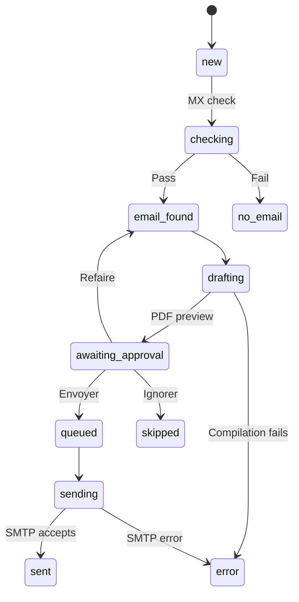

# Candidature Bot

**English** · [Français](README.fr.md) · [Deutsch](README.de.md) · [فارسی](README.fa.md)

**Prepare, review, and send job applications from Telegram.**

Candidature Bot is a self-hosted pipeline built with **n8n, PostgreSQL, Docker, and LaTeX**. You give the bot an employer's name and email address in a French-language Telegram chat. It checks the email domain, builds a cover-letter PDF, shows it to you for approval, and sends the approved application by email at a steady pace.

The letter is a fixed template: only the recipient block and the date change per employer. **No AI model writes or rewrites anything.**

*WF1, the Telegram interface. All four workflows are shown in [The workflows in n8n](docs/WORKFLOWS.md).*

## Features

- Guided employer entry, with optional address and HR contact.
- Pasted contact blocks and semicolon-separated bulk imports.
- Access limited to registered Telegram chats.
- Email-domain check (MX records) before any letter is drafted.
- Cover-letter PDFs compiled with Tectonic.
- Approval in Telegram with **Envoyer**, **Refaire**, and **Ignorer** buttons; nothing is sent without it.
- Scheduled SMTP sending with CV and declaration attached, capped per day.
- Status tracking and `/stats` summaries.

The supplied subject line and attachment name target a Luxembourg **DAP Agent administratif et commercial** apprenticeship. Adapt the subject, letter, email text, and declaration for other applications.

## How it works

Four workflows run independently and hand work to each other through the `status` of each employer record in PostgreSQL.

| Workflow | Schedule | Job |
|---|---|---|
| WF1 — Telegram poller | Every 5 seconds | Receive messages, run the dialog, save employers, apply approval decisions |
| WF2 — MX check | Every 2 minutes | Check up to 10 new email domains |
| WF3 — Drafting | Every 3 minutes | Build one letter and ask for approval |
| WF4 — Sending | Weekdays, every 30 minutes, 08:00 to 17:30 | Send one approved application per applicant |

`sent` means the mail server accepted the message, not that it reached the recipient. The schedule is meant to run in the `Europe/Luxembourg` timezone.

## Using the bot

| Command | Purpose |
|---|---|
| `/start` | Show the welcome message |
| `/nouveau` or `/new` | Start an employer entry |
| `/hr` or `/rh` | Enter HR details during an entry |
| `/annuler` | Cancel the current entry |
| `/stats` | Show application counts by status |

Send `/nouveau` and answer the questions, or paste all the details at once. Check the recap before saving: the bot cannot tell when a company name is paired with another company's email address.

When the PDF preview arrives:

- **Envoyer** queues the application for the next sending slot.
- **Refaire** builds it again from the current template. Buttons on the older preview then stop working.
- **Ignorer** skips the application.

See the [demo transcripts](docs/DEMO.md) for complete example sessions, including bulk import, with invented data.

## Setup and documentation

| Guide | Contents |
|---|---|
| [Installation and credentials](docs/SETUP.md) | Docker, database schema, private documents, credentials, first test send |
| [Demo transcripts](docs/DEMO.md) | What each scenario looks like in Telegram |
| [The workflows in n8n](docs/WORKFLOWS.md) | Screenshots of the four workflows and the repository layout |
| [Operations and limitations](docs/OPERATIONS.md) | Troubleshooting, recovery, known weaknesses |
| [Testing](docs/TESTING.md) | Database tests for the workflow queries and how to run them |
| [Publishing on GitHub](docs/PUBLISHING.md) | Sharing the workflows without leaking private data |

A deployment needs four things that are not in this repository: a `.env` file with your secrets, an applicant record, your private documents (letter template, email text, CV, declaration), and the credentials you enter in n8n.

## Limitations

- The MX check does not prove a mailbox exists, and a temporary DNS failure can mark a good domain as invalid.
- If WF1 fails after reading Telegram updates, those messages are lost.
- Overlapping WF4 runs cannot send the same application twice. A duplicate is still possible in one case: the mail server accepts a message and the workflow fails before recording it, and the application is then requeued by hand.
- A record interrupted in `checking` or `drafting` is picked up again after 15 minutes. One interrupted in `sending` is never retried automatically and waits for a manual check.
- Bounces and replies are not tracked.
- Parts of WF1 assume a single applicant.
- An employer is refused as a duplicate when its name or its email domain is already saved for the applicant.

Details and proposed fixes are in the [operations guide](docs/OPERATIONS.md).

## Status

The documentation comes from reading the workflows and configuration. The schema and every workflow query are covered by [database tests](docs/TESTING.md), including approval rules and concurrent sending. Those tests do not run n8n, Telegram, or a mail server, so the complete pipeline has not been tested end to end from this repository. Start with one applicant and send the first application to an address you control.

Telegram messages, DNS lookups, and email pass through external services, although everything else is self-hosted.
